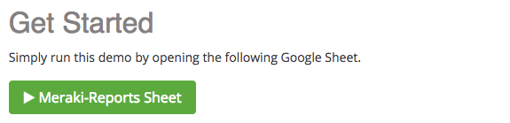
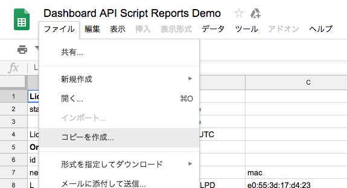
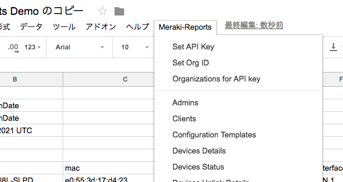
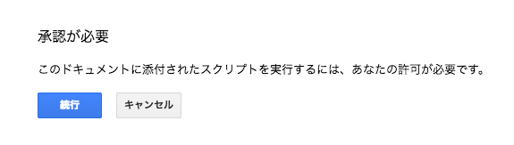

# 091418 Meraki Techincal Webinar Part 3

「テクノロジーパートナーとして付加価値の提供」ウェビナーで紹介した事例のコードの置き場。

## 概要

ウェビナーでは、Meraki API を使用した事例を紹介しました。その一部をこのレポジトリに置いておきます。また、資料は[ここから](http://bit.ly/2xvKfre)ダウンロードできます。

## Google Sheets へデータ入力

[このページ](http://bit.ly/2ODmxko)の Meraki-Reports Sheet というボタンをクリックし、

	

自分の Google Drive へ Sheet をコピーしてください。

	

この Sheet には、普段は存在しない Meraki-Reports というメニューが存在します。

	

Meraki-Reports 内のコマンドを実行するためには、Dashboard API キーと Organization ID を初めに設定する必要があります。Dashboard API キーは、Meraki-Reports > Set API Key をクリックし、表示されたポップアップへ Dashboard で取得した API キーを入力してください。Meraki-Reports 内のコマンドを実行するためには、App Scripts を許可しなければいけません。なので、下の画像のようなポップアップが表示されたら、手順に従って許可してください。

	

次に Meraki-Reports > Organizations for API key を実施し、Organization ID を取得してください。取得した Organization ID は Meraki-Reports > Set Org ID から設定してください。

Dashboard API キーと Organization ID を設定後、様々な情報を取得可能です。例えば、Meraki-Reports > Clients を実行していただければ、そのオーガナイゼーションに接続したことがある端末一覧の情報を取得できます。

## Splash ページを頻繁に表示

手順は[スライド](http://bit.ly/2xvKfre)の 22 から 29 をご確認ください。

